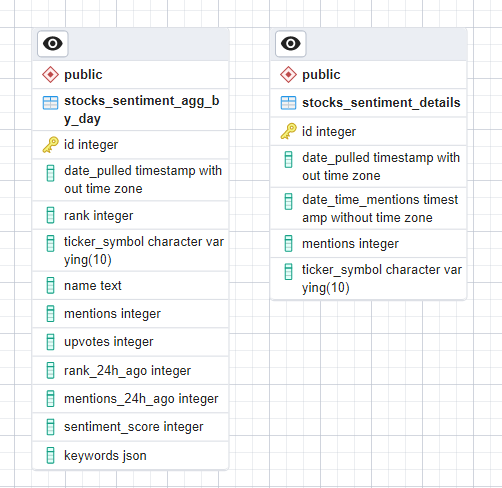
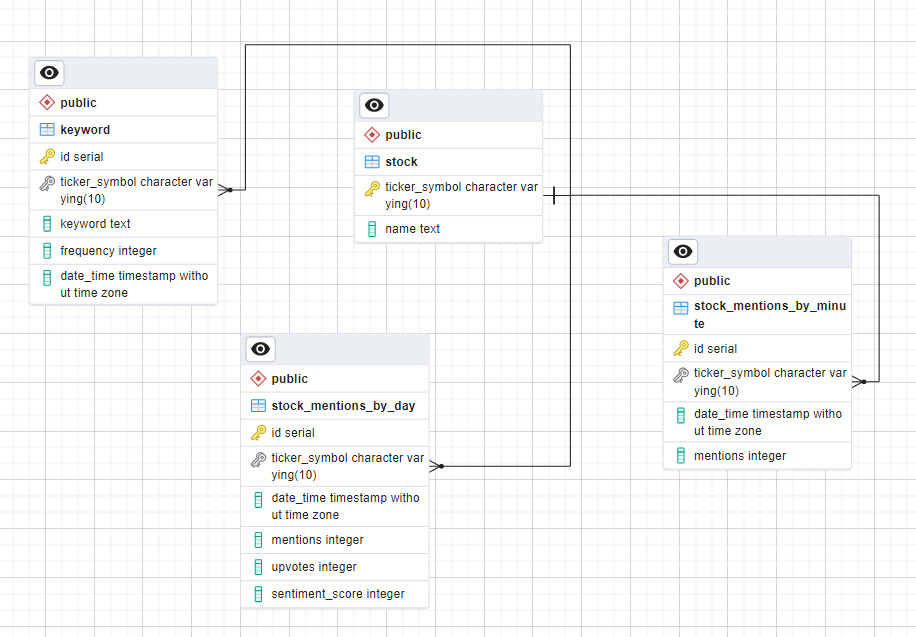
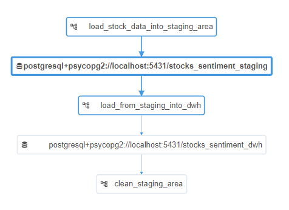
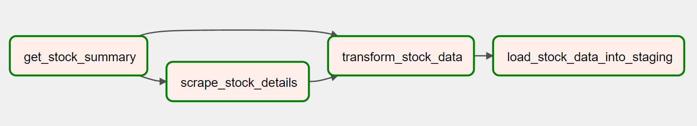

# Reddit Stock mentions Data Pipeline with Airflow and Postgres

## About this Project
The website https://apewisdom.io/ tracks the number of times a stock was mentioned on reddit in a given period of time. 
It displays the upvotes, mentions as well as the sentiment score and the keywords associated with a particular stock.

This project aims to extract the data displayed on this website
via their API and customized webscraping. The data is then transformed and stored in a postgres Database.
To orchestrate the pipeline process Apache Airflow was used.

The goal of the data pineline is to make the raw data from the website ready to be stored long term in a Data Warehouse and make the data ready for further analysis such as stock price prediction.

## Project Structure
````
│   .gitignore
│   docker-compose.yaml
│   README.md
│           
├───airflow_dataset_dag_structure
│       airflow_datasets.png
│       DAG_clean_staging_area.png
│       DAG_load_from_staging_into_dwh.png
│       DAG_load_stock_data_into_staging_area.png
│       
├───dags
│   │   clean_staging_area.py
│   │   load_from_staging_into_dwh.py
│   │   load_stockdata_into_staging.py
│   │   
│   ├───etl
│       │   db_loader.py
│       │   dwh_loader.py
│       │   transformer.py
│       │   webscraper.py
│       │   __init__.py
│   
│           
├───Database_setup
│       create_dwh_tables.sql
│       create_procedure.sql
│       create_staging_area_tables.sql
│       DWH_schema_design.png
│       staging_area_schema_design.png
````
The ````dags```` folder holds the main scripts as well as the dag definitions which drive the pipeline.
In the ````Database_setup```` folder all SQL-Scripts to create tables and procedures are stored.

## Database Setup

### Staging Area


The staging area consists of two tables which hold the raw data extracted from the website for 30 days.
The first table named ````stocks_sentiment_agg_by_day```` holds information about the number of times a stock was mentioned within 24h as well as the sentiment score and the keywords associated with it.
The second table named ````stocks_sentiment_details```` holds information about the stock mentions within a 10-minute timeframe. The schema is not normalized since it represents just a staging area. From here data will be extracted, transformed and loaded into the Data Warehouse.

### Data Warehouse


The Data Warehouse consists of two fact tables named ````stock_mentions_by_day```` and
````stock_mentions_by_minute````. These two tables hold information on different levels of aggregation and therefore can not be combined into one table.
The two dimension tables are the ````stock```` table which holds the ticker symbol and the stock name and the ````keyword```` table which holds the keywords associated with a specific stock on a given 24h period.
The schema is normalized to a useful degree for analysis. It would be possible to normalize the ````keyword```` table further.

## Airflow Setup
Airflow was set up using Docker. In total the pipeline consists of three different DAG`s and two Datasets.



The image above shows an overview of the pipeline with its dependencies which are the Datasets. The first DAG is triggered once every day. After that the other DAG\`s are triggered based on the completion of the DAG`s before.



This image shows the first DAG with its tasks in the Graph view. You can find details about how the DAG was defined in the ````dags```` folder.